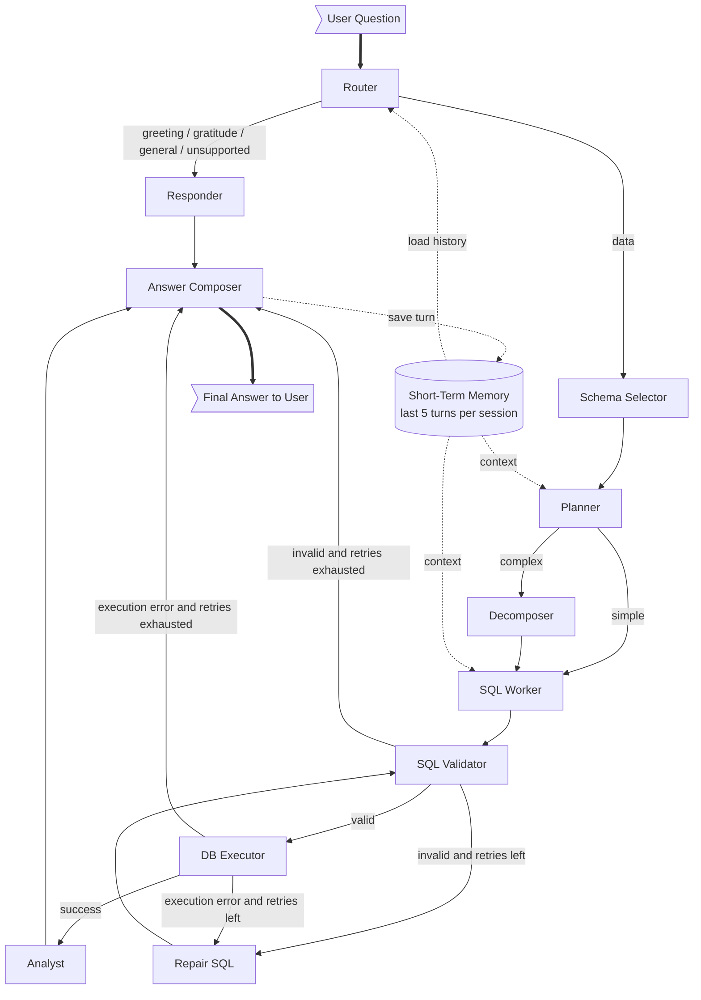

# Olist Multi-Agent BI System

A Python-based multi-agent Business Intelligence (BI) system for the **Olist e-commerce dataset**. Users ask natural language questions about Olist data; the system automatically generates SQL queries, executes them on the database, and provides insightful business analysis.

---

## About the Dataset

[Olist](https://olist.com/) is the largest department store in Brazilian e-commerce marketplaces. The **Brazilian E-Commerce Public Dataset by Olist** (originally published on [Kaggle](https://www.kaggle.com/datasets/olistbr/brazilian-ecommerce)) contains **~100 k orders placed between 2016 and 2018** across multiple Brazilian states. It includes nine interlinked tables covering:

| Area | What it captures |
| --- | --- |
| **Customers** | Unique customer IDs, city, and state |
| **Orders** | Order lifecycle timestamps (purchase → approved → shipped → delivered), status |
| **Order Items** | Products in each order, seller, price, and freight cost |
| **Payments** | Payment type, installments, value |
| **Reviews** | 1–5 star ratings and free-text review comments |
| **Products** | Category, dimensions, weight, photo count |
| **Sellers** | Seller location (city, state) |
| **Geolocation** | Latitude/longitude by ZIP code prefix |
| **Category Translation** | Portuguese → English product category names |

This dataset is widely used for e-commerce analytics, customer segmentation, delivery performance analysis, and marketplace benchmarking.

---

## Why This App?

Extracting insights from a 9-table relational dataset normally requires writing SQL by hand and interpreting raw result sets — a slow, technical process that excludes non-technical stakeholders.

**This system removes that barrier.** You ask a plain-English question like *"Which product categories have the worst reviews?"* and the multi-agent pipeline:

1. **Understands** your intent (routing, schema selection)
2. **Plans** simple or multi-step SQL strategies
3. **Generates & validates** safe, read-only SQL — with an automatic repair loop if anything goes wrong
4. **Executes** the query against a local SQLite copy of the dataset
5. **Analyzes** the results and returns a clear, data-grounded narrative

It turns raw e-commerce data into actionable business intelligence — instantly, conversationally, and without writing a single line of SQL.

---

## Multi-Agent Flow Diagram



ASCII fallback:

```text
  User Question (INPUT)
        |
        v
                     Short-Term Memory (last 5 turns)
                    /        |            |           \
              load history  context     context    save turn
                  |          |            |           |
                  v          v            v           |
      Router ----> Responder ---------------------------------> Answer Composer
        |                                                         |     |
        v                                                         |     v
   Schema Selector                                                | Final Answer
        |                                                         |  (OUTPUT)
        v                                                         |
   Planner ----simple----> SQL Worker -> SQL Validator -> DB Executor -> Analyst -> Answer Composer
        |                                     |                                       
        +---complex---> Decomposer -> SQL Worker                                     
                                        ^             |                              
                                        |             v                              
                                        +------ Repair SQL <----- validation / execution errors

```

| Node | Purpose | Main Output | Failure / Next Path |
| --- | --- | --- | --- |
| `router` | Classify request intent (uses conversation history for follow-ups) | `intent`, `response_type` | Routes to `responder` or `schema_selector` |
| `responder` | Handle greeting, gratitude, unsupported, and general requests | `final_answer` | Ends through `answer_composer` |
| `schema_selector` | Narrow schema to relevant Olist tables via keyword matching | `selected_tables`, `selected_schema` | Continues to `planner` |
| `planner` | Decide simple vs complex execution (inherits complexity from history); triggers on keywords like "compare", "trend", "monthly", "versus" | `complexity`, `plan` | Routes to `sql_worker` or `decomposer` |
| `decomposer` | Split complex questions into sub-questions using split tokens (`and`, `versus`, `vs`) | `sub_questions` | Continues to `sql_worker` |
| `sql_worker` | Generate SQL from question, plan, schema, and conversation history; includes error feedback on retries | `sql_query` | Continues to `sql_validator` |
| `sql_validator` | Enforce read-only SQL, whitelist tables, auto-inject `LIMIT 200` for non-aggregate queries | `validation_errors`, sanitized `sql_query` | Routes to `db_executor`, `repair_sql`, or `answer_composer` |
| `repair_sql` | Re-invoke SQL generation with validation/execution error context; increment `retry_count` | updated `sql_query`, incremented `retry_count` | Loops back to `sql_validator` |
| `db_executor` | Execute validated SQL against SQLite | `db_result`, `execution_error` | Routes to `analyst`, `repair_sql`, or `answer_composer` |
| `analyst` | Convert query result into narrative (caps at 20 rows per LLM call for token safety) | `analysis` | Continues to `answer_composer` |
| `answer_composer` | Normalize final response for CLI and Flask; cleans markdown formatting | `final_answer`, `response_type` | End state |

---

## Repository Structure

```text
.
├── app.py                  # Flask web server (production-ready)
├── main.py                 # Interactive CLI
├── get_schema.py           # Schema inspection utility
├── deploy.sh               # Automated EC2 deployment (Nginx + systemd)
├── gunicorn.conf.py        # Gunicorn production config
├── Dockerfile
├── docker-compose.yml
├── .env.example            # Environment variable template
├── .dockerignore
├── requirements.txt        # Pinned dependencies
├── data/                   # Olist CSV source files
├── src/
│   ├── config.py           # Centralized settings from env vars
│   ├── database.py         # SQLite init & query execution
│   ├── graph.py            # LangGraph state machine
│   ├── logger.py           # JSONL logging with PII masking
│   ├── memory.py           # Short-term conversation memory (in-RAM)
│   ├── state.py            # AgentState TypedDict
│   ├── agents/             # One module per workflow node
│   └── tools/
│       └── sql_tools.py    # Schema catalog, SQL validation, sanitization
├── templates/
│   └── index.html          # Web UI
└── tests/
    ├── test_agent_flow.py
    └── test_database_smoke.py
```

---

## LLM Configuration

| Setting | Value |
| --- | --- |
| **Model** | `llama-3.3-70b-versatile` (via Groq) |
| **Temperature** | `0.0` for SQL generation & analysis (deterministic); `0.2` for router/general responses |
| **LLM Timeout** | 35 seconds per call (hard timeout via `ThreadPoolExecutor`); 25 seconds for responder |
| **Token Tracking** | Extracted from LLM response metadata when available |

---

## Retry & Recovery Mechanism

The system includes a self-correcting SQL repair loop:

1. **SQL Worker** generates a query → sent to **SQL Validator**
2. If validation fails (bad table, forbidden keyword, etc.), the query enters a **repair loop**:
   - Error context is fed back to the SQL Worker as part of the prompt
   - `retry_count` is incremented
3. If the DB Executor encounters an execution error, the same repair loop is triggered
4. **Max retries**: 2 (configurable via `max_retries` in state)
5. After exhausting retries, the system routes to **Answer Composer** with an error-aware fallback message

A `confidence` score is tracked through the pipeline — it increments by `+0.05` on successful validation and is included in the API response metrics.

---

## Project Components

### `app.py` — Flask Web Server

* Serves the UI and `/query` JSON API
* Production hardening: API-key auth, rate limiting, CORS, input length validation
* `/health` endpoint for load balancer checks
* Runs behind Gunicorn in production

### `src/config.py` — Configuration

All settings are driven by environment variables (see `.env.example`):

| Variable | Default | Description |
| --- | --- | --- |
| `GROQ_API_KEY` | *(required)* | Groq API key |
| `API_KEY` | *(empty — auth disabled)* | Secret key clients send via `X-API-Key` header |
| `DEBUG` | `false` | Flask debug mode |
| `HOST` | `127.0.0.1` | Bind address |
| `PORT` | `5000` | Bind port |
| `RATE_LIMIT` | `30 per minute` | Request rate limit per IP |
| `CORS_ORIGINS` | `*` | Comma-separated allowed origins |
| `MAX_QUESTION_LENGTH` | `1000` | Max characters in a question |
| `LOG_LEVEL` | `INFO` | Logging verbosity |
| `GUNICORN_WORKERS` | `auto` | Number of Gunicorn workers |
| `GUNICORN_TIMEOUT` | `120` | Worker timeout (seconds) |

### `src/database.py` — Database Layer

* `init_database()` — ingests CSVs from `data/` into SQLite `olist.db`
* `execute_query()` — safe query runner using context-managed connections

### `src/tools/sql_tools.py` — SQL Safety

* **Whitelist-based table validation** — only the 9 Olist tables are allowed
* **Forbidden-pattern enforcement** — blocks `INSERT`, `UPDATE`, `DELETE`, `DROP`, `ALTER`, `ATTACH`, `PRAGMA`, and other write/admin keywords
* **Automatic `LIMIT 200`** injection for `SELECT` queries that lack aggregate functions or an explicit `LIMIT`
* **CTE-aware parsing** — correctly handles `WITH ... AS` clauses to avoid false-positive table-reference errors
* **Keyword → table mapping** — auto-selects relevant tables from the question (e.g., "revenue" → `order_items`, "rating" → `order_reviews`)
* Falls back to a broad default set (`orders`, `order_items`, `products`, `customers`, `order_payments`, `order_reviews`) when no keywords match

### `src/memory.py` — Short-Term Conversation Memory

* In-RAM store keyed by `session_id` (no disk persistence)
* Keeps the last **5 Q/A turns** per session for follow-up context
* Each turn stores: `(question, sql_query, answer)`
* Sessions auto-expire after **30 minutes** of inactivity (TTL-based eviction)
* Capped at **500 concurrent sessions** — oldest session is evicted FIFO when the limit is reached
* Thread-safe via locking (safe across Gunicorn workers within a single process)
* The `router`, `planner`, and `sql_worker` nodes read conversation history to resolve follow-up questions
* The frontend sends a `session_id` (stored in `sessionStorage`); a **New Chat** button resets the session
* Data is **not** written to disk — conversations are lost on server restart

### `src/logger.py` — Logging

* JSONL format for machine parsing
* PII masking (ZIP codes, emails) applied before writing
* Raw database result sets are **not** logged — only row counts

### `get_schema.py` — Schema Inspection Utility

* Standalone script to print the full SQLite database schema
* Useful for debugging or verifying table structures after initialization
* Run with: `python get_schema.py`

---

## Database Schema

| Table | Key Columns |
| --- | --- |
| **customers** | customer_id, city, state |
| **sellers** | seller_id, city, state |
| **products** | product_id, category_name, weight, photos_qty |
| **orders** | order_id, status, purchase_timestamp, delivery_dates |
| **order_items** | product_id, seller_id, price, freight_value |
| **order_payments** | payment_type, installments, payment_value |
| **order_reviews** | review_score, comment_message, creation_date |
| **geolocation** | zip_code, lat, lng, city, state |
| **translation** | category_name_portuguese, category_name_english |

---

## Example Questions

* "What is the total number of orders by month in 2018?"
* "Which state has the highest concentration of customers?"
* "List the top 5 product categories by total revenue."
* "Is there a correlation between freight value and review scores?"
* "Show me the top 3 sellers by sales volume."
* "Which product categories have the worst review scores and how does that compare to freight cost?"

---

## Web UI Features

The bundled frontend (`templates/index.html`) provides:

* **Dark theme** with glassmorphism, radial gradients, and grid overlay
* **Query input** with a "Run Analysis" button and **"New Chat"** button to reset the session
* **Suggested prompt chips** — 4 clickable example queries
* **Collapsible agent graph** — embedded Mermaid flowchart of the multi-agent pipeline
* **Result panels**:
  * **Strategic Analysis** — the final narrative answer
  * **SQL Trace** — the generated (sanitized) SQL query
  * **Execution Trace** — per-node timing breakdown (e.g., `router: 245ms → planner: 180ms → ...`)
  * **Query Metrics** — validation errors, repair attempts, confidence score, execution error
* **Response time** display
* **Loading animation** (3-bar pulse)
* **Error handling** — distinguishes network timeout (45 s hard abort) from application errors
* **Session management** — `session_id` generated client-side, stored in `sessionStorage`, sent with every request

---

## Local Deployment

```bash
# 1. Clone and set up
git clone <repo_url>
cd olist-bi-orchestrator
python -m venv venv
source venv/bin/activate

# 2. Install dependencies
pip install -r requirements.txt

# 3. Configure environment
cp .env.example .env
# Edit .env and set your GROQ_API_KEY

# 4. Initialize the database
python src/database.py

# 5. Run the web app (dev mode)
DEBUG=true python app.py
# Open http://127.0.0.1:5000

# 6. Run the CLI
python main.py

# 7. Run tests
python -m pytest -q
```

---

## Production Deployment on AWS EC2

### Prerequisites

* An AWS EC2 instance (Ubuntu 22.04+ recommended, t3.medium or larger)
* Security group rules:
  * Inbound TCP 22 (SSH) from your IP
  * Inbound TCP 80 (HTTP) from anywhere (or your VPN)
  * Inbound TCP 443 (HTTPS) from anywhere — if using TLS
* A Groq API key

### Option A: Docker Deployment (Recommended)

**1. Install Docker on EC2**

```bash
sudo apt-get update
sudo apt-get install -y docker.io docker-compose-v2
sudo systemctl enable docker
sudo usermod -aG docker $USER
# Log out and back in for group change to take effect
```

**2. Clone and configure**

```bash
git clone <repo_url>
cd olist-bi-orchestrator
cp .env.example .env
```

Edit `.env`:
```
GROQ_API_KEY=your-actual-key
API_KEY=a-strong-random-secret
CORS_ORIGINS=https://yourdomain.com
RATE_LIMIT=30 per minute
```

**3. Build and run**

```bash
docker compose up -d --build
```

**4. Verify**

```bash
curl http://localhost:5000/health
# {"status": "ok"}

curl -X POST http://localhost:5000/query \
  -H "Content-Type: application/json" \
  -H "X-API-Key: a-strong-random-secret" \
  -d '{"question": "How many orders are there?"}'
```

**5. Set up Nginx reverse proxy (recommended for HTTPS)**

```bash
sudo apt-get install -y nginx certbot python3-certbot-nginx
```

Create `/etc/nginx/sites-available/olist`:
```nginx
server {
    listen 80;
    server_name your-domain.com;

    location / {
        proxy_pass http://127.0.0.1:5000;
        proxy_set_header Host $host;
        proxy_set_header X-Real-IP $remote_addr;
        proxy_set_header X-Forwarded-For $proxy_add_x_forwarded_for;
        proxy_set_header X-Forwarded-Proto $scheme;
        proxy_read_timeout 120s;
    }
}
```

```bash
sudo ln -s /etc/nginx/sites-available/olist /etc/nginx/sites-enabled/
sudo nginx -t && sudo systemctl reload nginx

# Optional: enable HTTPS with Let's Encrypt
sudo certbot --nginx -d your-domain.com
```

### Option B: Direct Deployment (No Docker) — Automated Script

The repo includes `deploy.sh`, which automates the full setup (Python, venv, systemd, Nginx):

```bash
git clone <repo_url>
cd olist-bi-orchestrator
cp .env.example .env
# Edit .env — set at least GROQ_API_KEY

chmod +x deploy.sh
sudo ./deploy.sh
```

The script performs:
1. Installs Python 3, pip, and Nginx
2. Creates a dedicated `olist` system user (non-login)
3. Copies the app to `/opt/olist-bi/`
4. Creates a virtualenv and installs dependencies
5. Initializes the SQLite database from CSVs
6. Registers a **systemd** service for Gunicorn (`127.0.0.1:5000`)
7. Configures **Nginx** as a reverse proxy on port 80 with security headers

**After deployment:**

| Action | Command |
| --- | --- |
| Check status | `systemctl status olist-bi` |
| View logs | `tail -f /var/log/olist-bi/error.log` |
| Restart app | `sudo systemctl restart olist-bi` |
| Restart Nginx | `sudo systemctl restart nginx` |

### Option C: Manual Direct Deployment (No Docker)

**1. Install Python**

```bash
sudo apt-get update
sudo apt-get install -y python3.11 python3.11-venv python3-pip
```

**2. Clone and set up**

```bash
git clone <repo_url>
cd olist-bi-orchestrator
python3.11 -m venv venv
source venv/bin/activate
pip install -r requirements.txt
```

**3. Configure**

```bash
cp .env.example .env
# Edit .env with your keys
```

**4. Initialize DB and start**

```bash
python src/database.py
gunicorn -c gunicorn.conf.py app:flask_app
```

**5. Create a systemd service for auto-restart**

Create `/etc/systemd/system/olist-bi.service`:
```ini
[Unit]
Description=Olist BI Orchestrator
After=network.target

[Service]
User=ubuntu
WorkingDirectory=/home/ubuntu/olist-bi-orchestrator
EnvironmentFile=/home/ubuntu/olist-bi-orchestrator/.env
ExecStart=/home/ubuntu/olist-bi-orchestrator/venv/bin/gunicorn -c gunicorn.conf.py app:flask_app
Restart=always
RestartSec=5

[Install]
WantedBy=multi-user.target
```

```bash
sudo systemctl daemon-reload
sudo systemctl enable olist-bi
sudo systemctl start olist-bi
sudo systemctl status olist-bi
```

Then add Nginx as described in Option A, step 5.

---

## Security Checklist

- [x] SQL injection protection (whitelist validation, read-only enforcement)
- [x] API key authentication (optional, via `API_KEY` env var)
- [x] Rate limiting per IP
- [x] CORS configuration
- [x] Input length validation
- [x] `debug=False` by default
- [x] Non-root Docker user
- [x] PII masking in logs
- [x] Raw DB results excluded from logs
- [x] Generic error messages (no stack traces exposed to clients)
- [x] Pinned dependency versions
- [x] Gunicorn production server (not Flask dev server)

---

## Testing

Run the test suite with:

```bash
python -m pytest -q
```

**Test coverage:**

| Test | What it verifies |
| --- | --- |
| `test_router_detects_greeting` | "hello" is classified as `intent="greeting"` |
| `test_schema_selector_chooses_review_tables` | Keyword matching selects correct tables |
| `test_validate_sql_query_rejects_disallowed_table` | Whitelist enforcement blocks unknown tables |
| `test_validate_sql_query_adds_limit_for_row_queries` | Auto `LIMIT 200` injection works |
| `test_graph_handles_greeting_without_data_agents` | End-to-end greeting skips data pipeline |
| `test_flask_query_endpoint_handles_greeting` | Flask API returns correct response structure |
| `test_execute_query_returns_rows_and_columns` | Database read returns expected format |
| `test_execute_query_returns_error_for_invalid_sql` | Invalid SQL returns error dict |

---

## Notes

* `olist.db` is a generated local file. Rebuild it any time with `python src/database.py`.
* The Docker build runs `python src/database.py` automatically during image creation.
* The legacy `src/agents/orchestrator.py` file may still exist in the repo but the active workflow runs through `src/graph.py`.
* `get_schema.py` is a standalone utility for inspecting the database schema — not part of the agent pipeline.