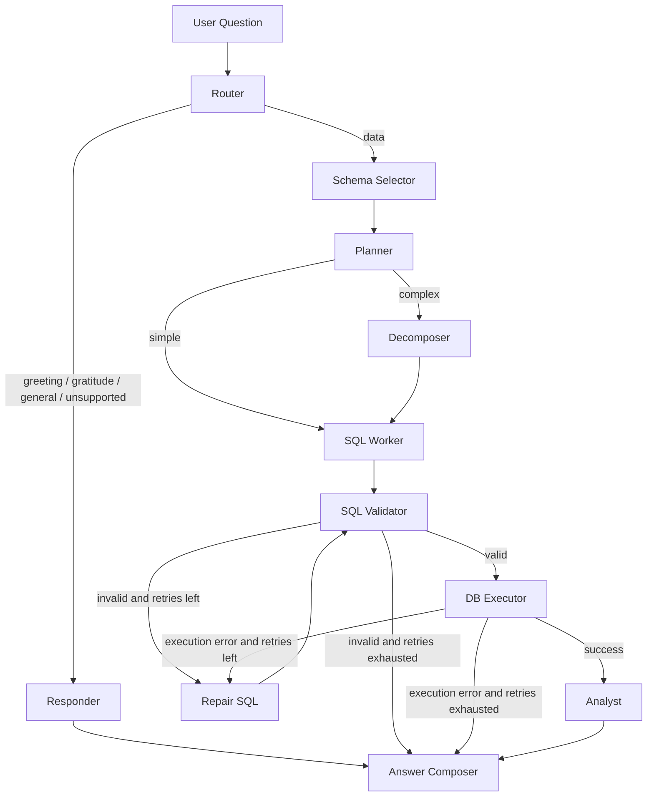

# Olist Multi-Agent BI System

A Python-based multi-agent Business Intelligence (BI) system for the **Olist e-commerce dataset**. Users ask natural language questions about Olist data; the system automatically generates SQL queries, executes them on the database, and provides insightful business analysis.

---

## Multi-Agent Flow Diagram



ASCII fallback:

```text
User Question
        |
        v
   Router --------------------------> Responder -----------------> Answer Composer
        |
        v
Schema Selector
        |
        v
   Planner ----simple----> SQL Worker -> SQL Validator -> DB Executor -> Analyst -> Answer Composer
        |
        +---complex---> Decomposer -> SQL Worker
                                        ^             |
                                        |             v
                                        +------ Repair SQL <----- validation / execution errors

```

| Node | Purpose | Main Output | Failure / Next Path |
| --- | --- | --- | --- |
| `router` | Classify request intent | `intent`, `response_type` | Routes to `responder` or `schema_selector` |
| `responder` | Handle greeting, gratitude, unsupported, and general requests | `final_answer` | Ends through `answer_composer` |
| `schema_selector` | Narrow schema to relevant Olist tables | `selected_tables`, `selected_schema` | Continues to `planner` |
| `planner` | Decide simple vs complex execution | `complexity`, `plan` | Routes to `sql_worker` or `decomposer` |
| `decomposer` | Split complex questions into sub-questions | `sub_questions` | Continues to `sql_worker` |
| `sql_worker` | Generate SQL from question, plan, and schema | `sql_query` | Continues to `sql_validator` |
| `sql_validator` | Enforce read-only and allowed-table SQL | `validation_errors`, sanitized `sql_query` | Routes to `db_executor`, `repair_sql`, or `answer_composer` |
| `repair_sql` | Retry SQL generation using validation or DB error feedback | updated `sql_query`, incremented `retry_count` | Loops back to `sql_validator` |
| `db_executor` | Execute validated SQL against SQLite | `db_result`, `execution_error` | Routes to `analyst`, `repair_sql`, or `answer_composer` |
| `analyst` | Convert query result into grounded narrative | `analysis` | Continues to `answer_composer` |
| `answer_composer` | Normalize final response for CLI and Flask | `final_answer`, `response_type` | End state |

---

## Repository Structure

```text
.
├── app.py                  # Flask web server (production-ready)
├── main.py                 # Interactive CLI
├── gunicorn.conf.py        # Gunicorn production config
├── Dockerfile
├── docker-compose.yml
├── .env.example            # Environment variable template
├── .dockerignore
├── requirements.txt        # Pinned dependencies
├── data/                   # Olist CSV source files
├── src/
│   ├── config.py           # Centralized settings from env vars
│   ├── database.py         # SQLite init & query execution
│   ├── graph.py            # LangGraph state machine
│   ├── logger.py           # JSONL logging with PII masking
│   ├── state.py            # AgentState TypedDict
│   ├── agents/             # One module per workflow node
│   └── tools/
│       └── sql_tools.py    # Schema catalog, SQL validation, sanitization
├── templates/
│   └── index.html          # Web UI
└── tests/
    ├── test_agent_flow.py
    └── test_database_smoke.py
```

---

## Project Components

### `app.py` — Flask Web Server

* Serves the UI and `/query` JSON API
* Production hardening: API-key auth, rate limiting, CORS, input length validation
* `/health` endpoint for load balancer checks
* Runs behind Gunicorn in production

### `src/config.py` — Configuration

All settings are driven by environment variables (see `.env.example`):

| Variable | Default | Description |
| --- | --- | --- |
| `GROQ_API_KEY` | *(required)* | Groq API key |
| `API_KEY` | *(empty — auth disabled)* | Secret key clients send via `X-API-Key` header |
| `DEBUG` | `false` | Flask debug mode |
| `HOST` | `127.0.0.1` | Bind address |
| `PORT` | `5000` | Bind port |
| `RATE_LIMIT` | `30 per minute` | Request rate limit per IP |
| `CORS_ORIGINS` | `*` | Comma-separated allowed origins |
| `MAX_QUESTION_LENGTH` | `1000` | Max characters in a question |
| `LOG_LEVEL` | `INFO` | Logging verbosity |
| `GUNICORN_WORKERS` | `auto` | Number of Gunicorn workers |
| `GUNICORN_TIMEOUT` | `120` | Worker timeout (seconds) |

### `src/database.py` — Database Layer

* `init_database()` — ingests CSVs from `data/` into SQLite `olist.db`
* `execute_query()` — safe query runner using context-managed connections

### `src/tools/sql_tools.py` — SQL Safety

* Whitelist-based table validation
* Forbidden-pattern enforcement (no INSERT/UPDATE/DELETE/DROP)
* Automatic `LIMIT 200` injection for row-level queries
* CTE-aware table-reference parsing

### `src/logger.py` — Logging

* JSONL format for machine parsing
* PII masking (ZIP codes, emails) applied before writing
* Raw database result sets are **not** logged — only row counts

---

## Database Schema

| Table | Key Columns |
| --- | --- |
| **customers** | customer_id, city, state |
| **sellers** | seller_id, city, state |
| **products** | product_id, category_name, weight, photos_qty |
| **orders** | order_id, status, purchase_timestamp, delivery_dates |
| **order_items** | product_id, seller_id, price, freight_value |
| **order_payments** | payment_type, installments, payment_value |
| **order_reviews** | review_score, comment_message, creation_date |
| **geolocation** | zip_code, lat, lng, city, state |
| **translation** | category_name_portuguese, category_name_english |

---

## Example Questions

* "What is the total number of orders by month in 2018?"
* "Which state has the highest concentration of customers?"
* "List the top 5 product categories by total revenue."
* "Is there a correlation between freight value and review scores?"
* "Show me the top 3 sellers by sales volume."
* "Which product categories have the worst review scores and how does that compare to freight cost?"

---

## Local Development

```bash
# 1. Clone and set up
git clone <repo_url>
cd olist-bi-orchestrator
python -m venv venv
source venv/bin/activate

# 2. Install dependencies
pip install -r requirements.txt

# 3. Configure environment
cp .env.example .env
# Edit .env and set your GROQ_API_KEY

# 4. Initialize the database
python src/database.py

# 5. Run the web app (dev mode)
DEBUG=true python app.py
# Open http://127.0.0.1:5000

# 6. Run the CLI
python main.py

# 7. Run tests
python -m pytest -q
```

---

## Production Deployment on AWS EC2

### Prerequisites

* An AWS EC2 instance (Ubuntu 22.04+ recommended, t3.medium or larger)
* Security group rules:
  * Inbound TCP 22 (SSH) from your IP
  * Inbound TCP 80 (HTTP) from anywhere (or your VPN)
  * Inbound TCP 443 (HTTPS) from anywhere — if using TLS
* A Groq API key

### Option A: Docker Deployment (Recommended)

**1. Install Docker on EC2**

```bash
sudo apt-get update
sudo apt-get install -y docker.io docker-compose-v2
sudo systemctl enable docker
sudo usermod -aG docker $USER
# Log out and back in for group change to take effect
```

**2. Clone and configure**

```bash
git clone <repo_url>
cd olist-bi-orchestrator
cp .env.example .env
```

Edit `.env`:
```
GROQ_API_KEY=your-actual-key
API_KEY=a-strong-random-secret
CORS_ORIGINS=https://yourdomain.com
RATE_LIMIT=30 per minute
```

**3. Build and run**

```bash
docker compose up -d --build
```

**4. Verify**

```bash
curl http://localhost:5000/health
# {"status": "ok"}

curl -X POST http://localhost:5000/query \
  -H "Content-Type: application/json" \
  -H "X-API-Key: a-strong-random-secret" \
  -d '{"question": "How many orders are there?"}'
```

**5. Set up Nginx reverse proxy (recommended for HTTPS)**

```bash
sudo apt-get install -y nginx certbot python3-certbot-nginx
```

Create `/etc/nginx/sites-available/olist`:
```nginx
server {
    listen 80;
    server_name your-domain.com;

    location / {
        proxy_pass http://127.0.0.1:5000;
        proxy_set_header Host $host;
        proxy_set_header X-Real-IP $remote_addr;
        proxy_set_header X-Forwarded-For $proxy_add_x_forwarded_for;
        proxy_set_header X-Forwarded-Proto $scheme;
        proxy_read_timeout 120s;
    }
}
```

```bash
sudo ln -s /etc/nginx/sites-available/olist /etc/nginx/sites-enabled/
sudo nginx -t && sudo systemctl reload nginx

# Optional: enable HTTPS with Let's Encrypt
sudo certbot --nginx -d your-domain.com
```

### Option B: Direct Deployment (No Docker)

**1. Install Python**

```bash
sudo apt-get update
sudo apt-get install -y python3.11 python3.11-venv python3-pip
```

**2. Clone and set up**

```bash
git clone <repo_url>
cd olist-bi-orchestrator
python3.11 -m venv venv
source venv/bin/activate
pip install -r requirements.txt
```

**3. Configure**

```bash
cp .env.example .env
# Edit .env with your keys
```

**4. Initialize DB and start**

```bash
python src/database.py
gunicorn -c gunicorn.conf.py app:flask_app
```

**5. Create a systemd service for auto-restart**

Create `/etc/systemd/system/olist-bi.service`:
```ini
[Unit]
Description=Olist BI Orchestrator
After=network.target

[Service]
User=ubuntu
WorkingDirectory=/home/ubuntu/olist-bi-orchestrator
EnvironmentFile=/home/ubuntu/olist-bi-orchestrator/.env
ExecStart=/home/ubuntu/olist-bi-orchestrator/venv/bin/gunicorn -c gunicorn.conf.py app:flask_app
Restart=always
RestartSec=5

[Install]
WantedBy=multi-user.target
```

```bash
sudo systemctl daemon-reload
sudo systemctl enable olist-bi
sudo systemctl start olist-bi
sudo systemctl status olist-bi
```

Then add Nginx as described in Option A, step 5.

---

## Security Checklist

- [x] SQL injection protection (whitelist validation, read-only enforcement)
- [x] API key authentication (optional, via `API_KEY` env var)
- [x] Rate limiting per IP
- [x] CORS configuration
- [x] Input length validation
- [x] `debug=False` by default
- [x] Non-root Docker user
- [x] PII masking in logs
- [x] Raw DB results excluded from logs
- [x] Generic error messages (no stack traces exposed to clients)
- [x] Pinned dependency versions
- [x] Gunicorn production server (not Flask dev server)

---

## Notes

* `olist.db` is a generated local file. Rebuild it any time with `python src/database.py`.
* The Docker build runs `python src/database.py` automatically during image creation.
* The legacy `src/agents/orchestrator.py` file may still exist in the repo but the active workflow runs through `src/graph.py`.